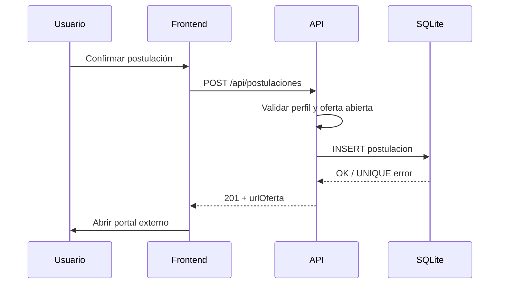

# Módulo O4 — Postulaciones, favoritos y seguimiento

Documentación del módulo de interacción del estudiante/egresado con oportunidades laborales (Bizagi O4) en EmpleaNet / Continental Oportunidades.

## Objetivo

Permitir al usuario autenticado:

1. Ver detalle completo de una oportunidad
2. Guardar y quitar favoritos (sin necesidad de postular)
3. Registrar postulación con confirmación
4. Consultar historial y estado de postulaciones
5. Hacer seguimiento de oportunidades vistas, postuladas y guardadas

## Reglas de negocio

| Regla | Implementación |
|-------|----------------|
| No duplicar postulación activa | Índice único `(perfil_id, empleo_id)` en `postulacion` → HTTP 409 |
| No postular a ofertas cerradas | `findForPostulacion()` valida `estado`, `activo` y `fecha_cierre` → HTTP 422 |
| Perfil mínimo para postular | Al menos una habilidad en perfil → HTTP 422 |
| Favoritos independientes | `favorito` no requiere postulación previa |
| Fecha y hora registradas | `fecha_postulacion`, `creado_en`, `visto_en` con `CURRENT_TIMESTAMP` |
| Historial persistente | Listados ordenados por fecha descendente |
| Seguimiento de vistas | UPSERT en `oportunidad_vista` al abrir detalle |

### Estados de postulación

Catálogo en tabla `estado_postulacion`:

| Código | Etiqueta | Uso |
|--------|----------|-----|
| `registrada` | Registrada | Estado inicial al crear postulación |
| `en_proceso` | En proceso | Seguimiento activo (futuro admin) |
| `cerrada` | Cerrada | Postulación finalizada |

Constantes en código: `ESTADOS_POSTULACION` en `postulaciones.schema.ts`.

## Base de datos

| Migración | Contenido |
|-----------|-----------|
| `004_postulacion_favorito.sql` | Tablas `postulacion` y `favorito` |
| `011_applications_tracking.sql` | Catálogo `estado_postulacion` y tabla `oportunidad_vista` |

### Tabla `postulacion`

- `perfil_id`, `empleo_id`, `estado`, `fecha_postulacion`
- Índice único por perfil + empleo

### Tabla `favorito`

- `perfil_id`, `empleo_id`, `creado_en`
- Índice único por perfil + empleo

### Tabla `oportunidad_vista`

- `perfil_id`, `empleo_id`, `visto_en`
- Una fila por par perfil + empleo; actualiza `visto_en` en visitas repetidas

## API (JWT, roles `estudiante` | `egresado`)

### Postulaciones — `/api/postulaciones`

| Método | Ruta | Descripción |
|--------|------|-------------|
| GET | `/` | Historial del perfil autenticado |
| GET | `/resumen` | `{ activas }` — postulaciones en `registrada` o `en_proceso` |
| GET | `/empleo/:empleoId` | `{ postulado, postulacion? }` |
| POST | `/` | Crear postulación `{ empleoId }` → 201 `{ postulacion, urlOferta }` |

### Favoritos — `/api/favoritos`

| Método | Ruta | Descripción |
|--------|------|-------------|
| GET | `/` | Listado de favoritos con datos del empleo |
| GET | `/empleo/:empleoId` | `{ esFavorito }` |
| POST | `/` | Guardar `{ empleoId }` → 201 |
| DELETE | `/:empleoId` | Quitar favorito → 204 |

### Seguimiento — `/api/seguimiento`

| Método | Ruta | Descripción |
|--------|------|-------------|
| GET | `/resumen` | Contadores: postulaciones, activas, favoritos, vistas |
| GET | `/vistas` | Historial de oportunidades vistas |
| POST | `/vistas` | Registrar vista `{ empleoId }` → 201 `{ vista }` |

## Frontend

| Ruta | Componente | Función |
|------|------------|---------|
| `/empleos/:id` | `EmpleoDetallePage` | Detalle, favorito, postular con modal de confirmación, registro de vista |
| `/postulaciones` | `PostulacionesPage` | Historial con estado y fecha |
| `/favoritos` | `FavoritosPage` | Ofertas guardadas |
| `/seguimiento` | `SeguimientoPage` | Panel unificado con pestañas postuladas / guardadas / vistas |

## Estructura backend

```
apps/api/src/modules/
├── postulaciones/   # CRUD postulaciones
├── favoritos/       # CRUD favoritos
└── seguimiento/     # Vistas y resumen agregado
```

Inicialización de esquema en `getDb()` vía `ensurePostulacionFavoritoSchema()` y `ensureApplicationsTrackingSchema()`.

## Tests

Archivo: `apps/api/src/modules/postulaciones/postulaciones.test.ts`

| Caso | Verificación |
|------|--------------|
| Postulación válida | HTTP 201, estado `registrada`, fecha presente |
| Postulación duplicada | HTTP 409 |
| Oferta cerrada | HTTP 422 |
| Favorito agregado | HTTP 201 con `creadoEn` |
| Favorito eliminado | HTTP 204, `esFavorito: false` |
| Historial correcto | GET listado + registro de vista + resumen |

Ejecutar:

```bash
cd apps/api && pnpm test
```

## Flujo de postulación



## Notas

- La postulación en EmpleaNet es un **registro de intención**; el proceso formal continúa en el portal externo (`url_oferta`).
- Las ofertas cerradas o archivadas no aparecen en el marketplace (`SQL_OFERTA_PUBLICA`) pero la validación de postulación también rechaza empleos no postulables aunque se conozca el ID.
