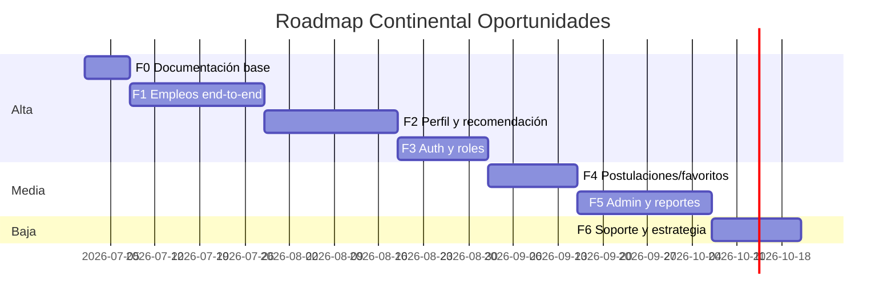

# Roadmap de desarrollo — Continental Oportunidades

> Plan de implementación técnico derivado de la [auditoría inicial](IMPLEMENTATION_AUDIT.md), alineado con procesos Bizagi (`/bizagi`), mockups (`/mockups`) y documentación canónica (`docs/01`–`10`).

**Principio rector:** evolución por fases sin cambiar stack ni sobreingenierizar. Cada fase cierra un entregable verificable antes de abrir la siguiente.

---

## Visión de fases



---

## Fase 0 — Documentación y alineación

**Objetivo:** Base documental única para desarrollo coherente con la tesis.

| Entregable | Estado |
|------------|--------|
| `IMPLEMENTATION_AUDIT.md` | ✅ |
| `DEVELOPMENT_ROADMAP.md` | ✅ |
| `PROJECT_CONTEXT.md`, `SYSTEM_RULES.md`, `MODULES.md`, `UI_FLOW.md`, `DB_RULES.md` | En rama `feature/base-documental-desarrollo` |
| README actualizado | ✅ |

**Criterio de cierre:** equipo puede identificar qué está implementado vs pendiente sin leer código.

---

## Fase 1 — Recolección real y empleos end-to-end

**Prioridad:** 🔴 Alta  
**Bizagi:** O2, S5 | **Mockups:** marketplace, detalle de oportunidad

### Backend / worker
- [x] Ejecutar worker Remotive y verificar datos en `database/empleanet.db`
- [x] Confirmar deduplicación por `url_oferta`
- [x] Registrar fuente "Remotive" en `fuente_empleo`
- [x] Actualizar `docs/00-estado-actual.md` al cerrar 2.3

### Frontend
- [x] Aplicar design system (`mockups/continental_oportunidades_design_system/DESIGN.md`)
- [x] Pantalla marketplace: listado + filtros (`q`, ubicación, modalidad, fuente) + paginación
- [x] Pantalla detalle `/empleos/:id` con enlace a oferta original
- [x] Layout sidebar + header según mockups

### Verificación
```bash
python -m recolector
curl "http://localhost:4000/api/empleos?fuente=Remotive"
# Navegar /empleos y /empleos/:id con datos reales
```

**Exclusiones:** no tocar perfil, recomendaciones ni auth.

---

## Fase 2 — Perfil y motor de recomendación

**Prioridad:** 🔴 Alta  
**Bizagi:** O1 (perfil), O3, S2 | **Mockups:** dashboard estudiante

### Backend
- [ ] `GET/PUT /api/perfil/me` contra tabla `perfil`
- [ ] Motor por reglas (`docs/08-motor-recomendacion.md`): habilidades, modalidad, ubicación, actualidad
- [ ] Persistir scores en `recomendacion` (índice único perfil+empleo)
- [ ] `GET /api/recomendaciones` con puntaje y motivo

### Frontend
- [ ] Formulario perfil (habilidades, ubicación)
- [ ] Sección recomendados en dashboard estudiante
- [ ] Ordenamiento por relevancia (O3)

### Verificación
Perfil editado → recomendaciones distintas → motivo visible en UI.

---

## Fase 3 — Autenticación y roles

**Prioridad:** 🔴 Alta  
**Bizagi:** O1, S3 | **Mockup:** inicio de sesión

### Alcance MVP auth
- [ ] Roles: `estudiante`, `egresado`, `administrador`, `soporte`
- [ ] Login/logout; protección de rutas
- [ ] Tablas `usuario` + sesión/JWT (según `docs/04-seguridad.md`)
- [ ] Pantalla login según mockup

### Exclusiones
- SSO institucional (fase futura)
- Recuperación de contraseña avanzada (solo flujo básico si tiempo)

---

## Fase 4 — Postulaciones y favoritos

**Prioridad:** 🟡 Media  
**Bizagi:** O4

### Backend
- [ ] Tablas `postulacion`, `favorito`
- [ ] Endpoints: registrar postulación, listar historial, guardar/quitar favorito
- [ ] Redirección a `url_oferta` externa (no postulación automática)

### Frontend
- [ ] Acciones en detalle: postular / guardar
- [ ] Seguimiento de estado en dashboard estudiante

---

## Fase 5 — Administración y reportes

**Prioridad:** 🟡 Media  
**Bizagi:** O2 (manual), O5 | **Mockups:** gestión ofertas, dashboard reportes

### Backend
- [ ] CRUD ofertas manuales (admin)
- [ ] Endpoints reportes: conteos usuarios, ofertas, recomendaciones, postulaciones

### Frontend
- [ ] Panel gestión ofertas
- [ ] Dashboard reportes con exportación básica (CSV)

---

## Fase 6 — Soporte, estrategia y endurecimiento

**Prioridad:** 🟢 Baja  
**Bizagi:** E1–E3, S4 | **Mockups:** panel estratégico, config. motor

- [ ] Pantalla soporte: parámetros del motor de recomendación
- [ ] Panel estratégico: indicadores agregados (solo lectura)
- [ ] Logs de auditoría básicos
- [ ] Script de respaldo SQLite
- [ ] Pruebas de humo / E2E en flujos críticos
- [ ] Evaluación de segunda fuente externa (post-Remotive)

---

## Matriz de dependencias

| Fase | Depende de | Bloquea |
|------|------------|---------|
| F1 | F0 | F2, F3, F4, F5 |
| F2 | F1 | F4, F5 |
| F3 | F2 | F4, F5 |
| F4 | F3 | F5 |
| F5 | F3, F4 | F6 |
| F6 | F5 | — |

---

## Relación con roadmap canónico (`docs/10-roadmap.md`)

| Doc canónico | Este roadmap |
|--------------|--------------|
| Fase 2.3 Remotive | → Fase 1 (worker) |
| Cierre visual empleos | → Fase 1 (frontend) |
| Módulo perfil | → Fase 2 |
| Módulo recomendaciones | → Fase 2 |
| Fuentes adicionales | → Fase 6 |

Este documento **extiende** `docs/10-roadmap.md` con fases de auth, postulaciones, admin y soporte requeridas por la tesis y los procesos Bizagi, sin contradecir las reglas de no sobreingeniería del MVP.

---

## Próximo paso inmediato

**Fase 1:** verificar worker Remotive + implementar UI marketplace y detalle con design system institucional.

Ver también: [`IMPLEMENTATION_AUDIT.md`](IMPLEMENTATION_AUDIT.md) · [`MODULES.md`](MODULES.md) · [`UI_FLOW.md`](UI_FLOW.md)
