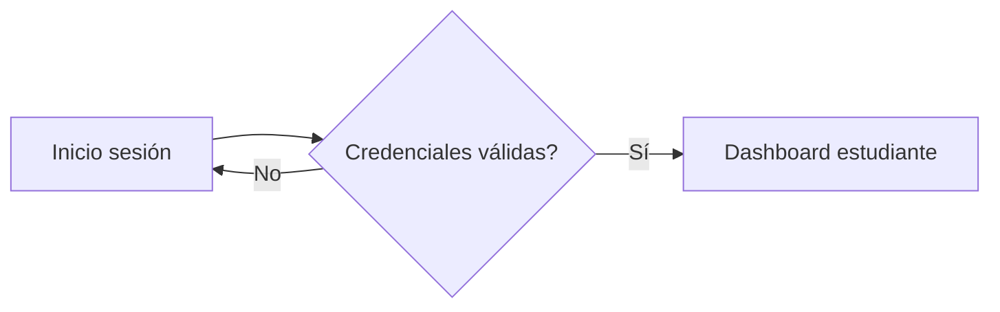
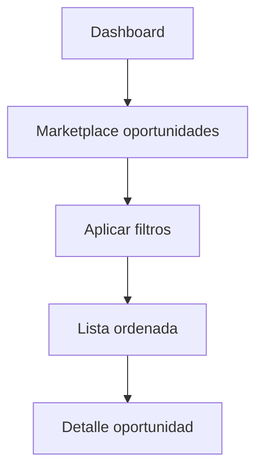
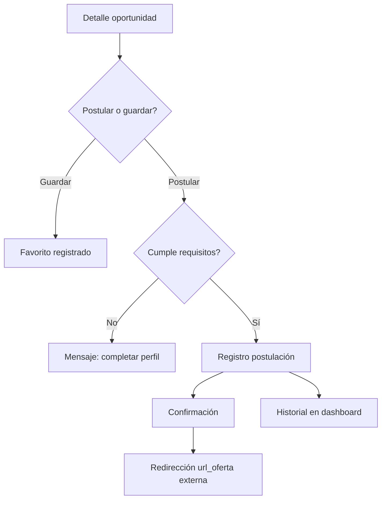
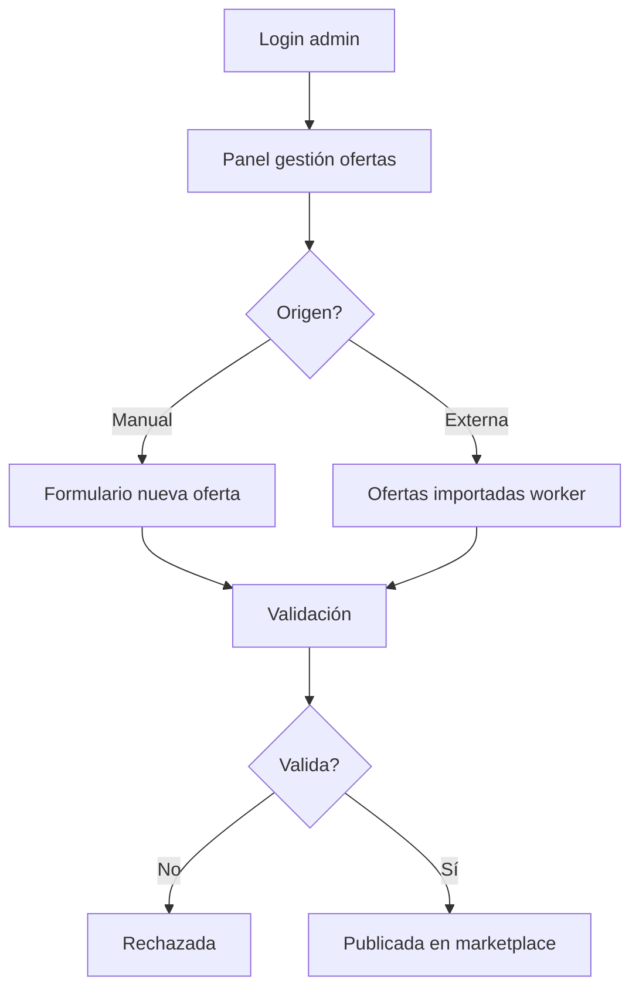

# Flujos de interfaz — Continental Oportunidades

Flujos de usuario alineados con mockups (`/mockups`) y procesos operativos Bizagi (`O1`–`O5`).

**Design system:** `mockups/continental_oportunidades_design_system/DESIGN.md`  
**Layout base:** sidebar izquierdo (260px) + header (64px) + área de contenido en grid 12 columnas.

---

## 1. Flujo estudiante / egresado

### 1.1 Login → dashboard

| Paso | Acción | Mockup | Ruta planificada | Estado |
|------|--------|--------|------------------|--------|
| 1 | Ingresar correo institucional y contraseña | `inicio_de_sesi_n_*` | `/login` | ❌ |
| 2 | Validación de credenciales | O1, S3 | API auth | ❌ |
| 3 | Redirección a dashboard personal | `dashboard_de_estudiante_*` | `/dashboard` | ⚠️ `/` básico |

### 1.2 Búsqueda y exploración de oportunidades

| Paso | Acción | Mockup | Ruta | Bizagi | Estado |
|------|--------|--------|------|--------|--------|
| 1 | Ver listado de ofertas | `marketplace_*` | `/empleos` | O3 t1 | ⚠️ lista básica |
| 2 | Buscar por texto (`q`) | marketplace (barra búsqueda) | `/empleos?q=` | O3 t2 | ❌ UI |
| 3 | Filtrar ubicación/modalidad/fuente | marketplace (filtros) | query params | O3 t2 | ❌ UI |
| 4 | Paginar resultados | marketplace | `page`, `limit` | O3 t6 | ❌ UI |
| 5 | Abrir detalle | `detalle_de_oportunidad_*` | `/empleos/:id` | O4 t1 | ❌ ruta |

**API disponible:** `GET /api/empleos` con filtros ✅

### 1.3 Recomendaciones personalizadas

| Paso | Acción | Mockup | Ruta | Bizagi | Estado |
|------|--------|--------|------|--------|--------|
| 1 | Sistema recupera perfil | dashboard (sección recomendados) | API perfil | O3 t3 | ⚠️ stub |
| 2 | Motor calcula coincidencias | dashboard (cards con puntaje) | API recomendaciones | O3 t4-t5 | ❌ |
| 3 | Usuario ve top N ordenados | dashboard | `/recomendados` | O3 t6-t7 | ⚠️ stub |

### 1.4 Postulación y seguimiento

| Paso | Acción | Mockup | Bizagi | Estado |
|------|--------|--------|--------|--------|
| 1 | Ver detalle completo | `detalle_*` | O4 t1 | ❌ UI |
| 2 | Guardar favorito | detalle (botón guardar) | O4 t_fav | ❌ |
| 3 | Postular | detalle (botón postular) | O4 t2-t3 | ❌ |
| 4 | Confirmación | detalle (modal) | O4 t4 | ❌ |
| 5 | Seguimiento estado | dashboard (tabla postulaciones) | O4 t5-t6 | ❌ |

### 1.5 Gestión de perfil

| Paso | Acción | Mockup | Bizagi | Estado |
|------|--------|--------|--------|--------|
| 1 | Ver perfil actual | dashboard (panel perfil) | O1 t4-t5 | ⚠️ |
| 2 | Editar habilidades, ubicación | dashboard (formulario) | O1 t6 | ❌ |
| 3 | Guardar → recalcular recomendaciones | dashboard | S2, O3 | ❌ |

**Ruta actual:** `/perfil` (básico)

---

## 2. Flujo administrador

### 2.1 Gestión de ofertas

| Paso | Acción | Mockup | Bizagi | Estado |
|------|--------|--------|--------|--------|
| 1 | Acceder panel admin | `gesti_n_de_ofertas_*` | O2 | ✅ |
| 2 | Crear oferta manual | gestión (formulario + tabla) | O2 t1 | ✅ |
| 3 | Revisar ofertas importadas | gestión (tabla con fuente) | O2 t2, S5 | ✅ |
| 4 | Validar y publicar | gestión (acciones fila) | O2 t3-t5 | ⚠️ Manual directo |
| 5 | Cerrar/actualizar oferta | gestión (archivar) | O2 t6 | ✅ |

**Ruta:** `/admin/ofertas`

### 2.2 Reportes institucionales

| Paso | Acción | Mockup | Bizagi | Estado |
|------|--------|--------|--------|--------|
| 1 | Consultar indicadores | `dashboard_de_reportes_*` | O5 t1 | ✅ |
| 2 | Ver reportes paralelos (usuarios, ofertas, rec., postulaciones) | dashboard reportes (cards + gráficos) | O5 r1-r4 | ✅ |
| 3 | Exportar / visualizar | dashboard reportes (export CSV) | O5 t2 | ✅ |

**Ruta:** `/admin/reportes`

### 2.3 Panel estratégico

| Paso | Acción | Mockup | Bizagi | Estado |
|------|--------|--------|--------|--------|
| 1 | Analizar indicadores agregados | `panel_estrat_gico_*` | E3 t1-t2 | ✅ |
| 2 | Identificar mejoras | panel estratégico | E3 | ✅ |
| 3 | Priorizar cambios | panel estratégico | E3 t3-t4 | ✅ |

**Ruta:** `/admin/estrategico`

---

## 3. Flujo soporte técnico

### 3.1 Configuración del motor de recomendación

| Paso | Acción | Mockup | Bizagi | Estado |
|------|--------|--------|--------|--------|
| 1 | Acceder config. motor | `configuraci_n_del_motor_*` | S2 t1-t2 | ✅ |
| 2 | Ajustar ponderaciones (habilidades, modalidad, etc.) | config. motor (sliders/form) | S2 t2 | ✅ |
| 3 | Ejecutar evaluación de desempeño | config. motor | S2 t3-t4 | ✅ |
| 4 | Optimizar si no es óptimo | config. motor | S2 t5 | ✅ |

**Ruta:** `/soporte/motor`

### 3.2 Mantenimiento e incidencias

| Paso | Acción | Bizagi | Estado |
|------|--------|--------|--------|
| 1 | Registrar incidencia | S4 t1 | ✅ |
| 2 | Diagnóstico técnico | S4 t2 | ✅ |
| 3 | Corrección / actualización | S4 t3-t4 | ✅ |
| 4 | Validación posterior | S4 t5 | ✅ |

**Ruta:** `/soporte/incidencias`

---

## 4. Mapa completo mockup → flujo → implementación

| Mockup | Flujo | Actor | Ruta objetivo | Fase |
|--------|-------|-------|---------------|------|
| `inicio_de_sesi_n_*` | Login | Todos | `/login` | F3 |
| `marketplace_*` | Búsqueda/filtrado | Estudiante | `/empleos` | F1 |
| `detalle_de_oportunidad_*` | Detalle + postular/guardar | Estudiante | `/empleos/:id` | F1, F4 |
| `dashboard_de_estudiante_*` | Home + perfil + recomendados + postulaciones | Estudiante | `/dashboard` | F2, F4 |
| `gesti_n_de_ofertas_*` | CRUD ofertas | Admin | `/admin/ofertas` | F5 |
| `dashboard_de_reportes_*` | Reportes | Admin | `/admin/reportes` | F5 |
| `panel_estrat_gico_*` | Mejora continua | Comité/Admin | `/admin/estrategico` | F6 |
| `configuraci_n_del_motor_*` | Config. motor | Soporte | `/soporte/motor` | F6 |
| `continental_oportunidades_design_system/` | Transversal | — | CSS/tokens global | F1 |

---

## 5. Navegación planificada (sidebar)

### Estudiante / egresado
- Dashboard
- Oportunidades (marketplace)
- Recomendados
- Mis postulaciones
- Favoritos
- Mi perfil

### Administrador
- Dashboard reportes
- Gestión de ofertas
- Panel estratégico (F6)

### Soporte
- Configuración motor
- Incidencias (F6)

---

## 6. Estado actual vs objetivo

| Flujo | Pantallas mockup | Pantallas web actuales | Brecha |
|-------|------------------|------------------------|--------|
| Estudiante completo | 4 | 4 básicas (sin diseño) | UI + auth + postulaciones |
| Admin | 2–3 | 0 | Todo |
| Soporte | 1 | 0 | Todo |

**Próximo hito UI (Fase 1):** marketplace + detalle con design system, sin auth (acceso abierto temporal).

Ver [`DEVELOPMENT_ROADMAP.md`](DEVELOPMENT_ROADMAP.md) · [`MODULES.md`](MODULES.md)
